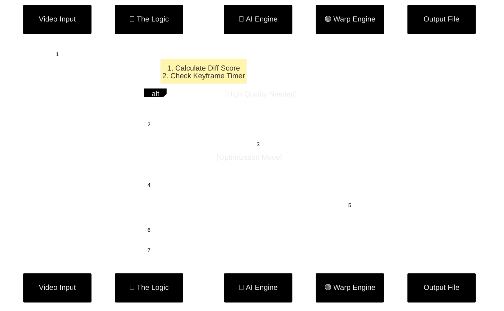

# VideoVision

High-performance video upscaling inference wrapper for Real-ESRGAN. Optimizes throughput by combining deep learning inference with dense optical flow warping.

Includes a demo clip in `inputs/onepiece_demo.mp4` for immediate testing.

### Optimization Strategy

Standard upscalers run heavy model inference on every frame. VideoVision reduces computational load via:

*   **Optical Flow Warping:** Reuses high-resolution features from previous frames by calculating pixel motion (dense optical flow) and warping the result. Reduces GPU load significantly.
*   **Scene Change Detection:** Monitors frame difference histograms. Automatically forces a full inference refresh when a scene cut is detected to prevent ghosting artifacts.
*   **Variable Inference Intervals:** Configurable keyframe ratios allowing users to trade temporal stability for raw throughput (e.g., infer 1 frame, warp 3 frames).


### Usage

The interface simplifies model selection and tiling parameters.

**Anime (Balanced Speed/Quality)**
Runs inference every 2nd frame, warps intermediate frames.
```bash
python videovision.py -i inputs/onepiece_demo.mp4 --mode anime --speed balanced
```

**High Throughput**
Runs inference every 4th frame. Best for limited hardware or high-framerate source material.
```bash
python videovision.py -i inputs/onepiece_demo.mp4 --mode anime --speed fastest
```

**General / Live Action (Max Quality)**
Disables warping. Runs inference on every frame. Includes GFPGAN face enhancement.
```bash
python videovision.py -i inputs/my_vlog.mp4 --mode general --face_enhance --speed slow
```

### Configuration

| Argument | Options | Description |
| :--- | :--- | :--- |
| `--mode` | `anime`, `general` | Selects appropriate Real-ESRGAN checkpoint. |
| `--speed` | `slow` | Full inference every frame. No warping. |
| | `balanced` | Inference every 2nd frame. 2x theoretical throughput. |
| | `fastest` | Inference every 4th frame. 4x theoretical throughput. |
| `-s` | `2`, `4` | Upscaling factor. |
| `-t` | `0`, `400`, `256` | Tile size. Lower this value to reduce VRAM usage. |
| `--face_enhance` | Flag | Enables GFPGAN. Only available in `general` mode. |

### Installation

Requires standard Real-ESRGAN dependencies.

```bash
pip install -r requirements.txt
python setup.py develop
```

### Credits

Wrapper around [Real-ESRGAN](https://github.com/xinntao/Real-ESRGAN).
Optical flow implementation uses OpenCV Farneback algorithm.
